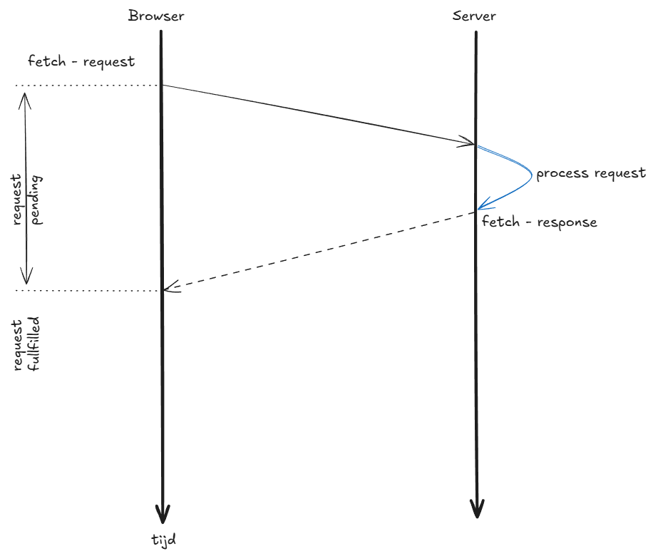
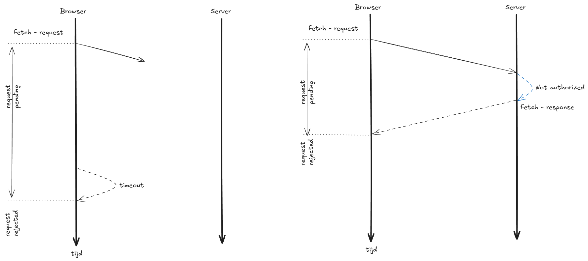

# Fetch and Promises

Promises zijn het belangrijkste maar ook het meest complexe concept in JavaScript om te begrijpen. Het is een concept waar je als frontend developer niet omheen kunt, omdat een frontend van nature uit asynchroon is, en Promises zijn de manier waarop JavaScript omgaat met asynchrone operaties.

Tot nu toe heb je met name met synchrone code gewerkt, waarbij elke regel code direct een resultaat teruggeeft, en de volgende regel pas wordt uitgevoerd nadat de vorige regel klaar is. Maar in een frontend applicatie heb je ook te maken met asynchrone operaties, zoals het luisteren naar events, of het communiceren met een backend, waarbij je niet weet hoe lang het zal duren voordat je een resultaat terugkrijgt, en je wilt niet dat je applicatie vastloopt terwijl je wacht op dat resultaat. Daarom is het belangrijk om te begrijpen dat JavaScript asynchroon is, en dat Promises een manier zijn om te werken met asynchrone operaties op een gestructureerde manier.

De meest gangbare manier om te communiceren met een backend in JavaScript is door gebruik te maken van de Fetch API, die een moderne en flexibele manier biedt om HTTP requests te maken vanuit onze frontend code. 
De fetch functie verwacht twee argumenten. Het eerste argument is de URL waar we het request naartoe willen sturen, en het tweede argument is een optioneel object. In dat object  kunnen we bijvoorbeeld aangeven welke methode we willen gebruiken (GET, POST, PUT, DELETE, etc.), kunnen we een body meegeven met data die we willen versturen naar de backend, maar we kunnen ook de headers specificeren die we willen meesturen met ons request, zoals bijvoorbeeld een Content-Type header om aan te geven dat we JSON data meesturen in de body van ons request.
Wat de fetch functie teruggeeft is een Promise, die een response object zal bevatten als het request succesvol is, of een error zal bevatten als er iets misgaat tijdens het versturen van het request. Omdat het een Promise is, kunnen we gebruik maken van de .then en .catch methoden om te reageren op het moment dat de Promise wordt fulfilled of rejected, en zo kunnen we bijvoorbeeld de response data verwerken als het request succesvol is, of een foutmelding tonen aan de gebruiker als er iets misgaat.

```javascript
const result = fetch('./api/authentication', {
    method: 'POST',
    headers: {
        'Content-Type': 'application/json'
    },
    body: JSON.stringify(data)
});
console.log(result); // Dit zal een Promise object loggen, en niet het resultaat van de fetch request.
```

Na het versturen van de fetch request bevindt de Promise zich in de pending staat, omdat we nog niet weten of het request succesvol zal zijn of dat er een fout zal optreden. Hoe lang de Promise in de pending staat blijft, weten we niet. Als onze applicatie nu zou wachten op het resultaat van de fetch request, dan zou dat betekenen dat het voor de gebruiker lijkt alsof de applicatie is gecrasht, omdat er geen feedback is dat er iets aan de hand is. Daarom is het belangrijk om te begrijpen dat JavaScript asynchroon is, en dat we met Promises kunnen werken om te zorgen dat onze applicatie responsief blijft, zelfs als we wachten op een response van de backend.

In de code hierboven zie je dat we de fetch functie aanroepen, en dat we het resultaat loggen. Omdat de fetch functie een Promise teruggeeft, zal het resultaat dat we loggen een Promise object zijn, en niet het resultaat van de fetch request. We kunnen dus niet direct met het resultaat van de fetch request werken, omdat we nog niet weten wanneer het resultaat beschikbaar zal zijn. 

Er is wel een workaround door het keywordt `await` te gebruiken, maar dat is een onderwerp voor later. Voor nu is het belangrijk om te begrijpen dat de fetch functie een Promise teruggeeft, en dat we met die Promise moeten werken om te kunnen reageren op het moment dat het resultaat van de fetch request beschikbaar is.



Als onze fetch request verstuurd wordt, dan bevindt de Promise zich in de pending staat, omdat we nog niet weten of het request succesvol zal zijn of dat er een fout zal optreden. Op het moment dat we een response ontvangen van de backend, zal de Promise overgaan naar de fulfilled staat als het request succesvol was.

Maar het kan ook gebeuren dat er een fout optreedt tijdens het versturen van het request, bijvoorbeeld als er een netwerkfout is, of als de backend een foutstatus teruggeeft. In dat geval zal de Promise overgaan naar de rejected staat.



Zoals eerder aangegeven heeft het niet veel nut om het resultaat van de fetch request op te slaan, omdat dat een Promise object zal zijn, en niet het resultaat van de fetch request. In plaats daarvan kunnen we gebruik maken van de `.then` en `.catch` methoden om te reageren op het moment dat de Promise wordt fulfilled of rejected, en zo kunnen we bijvoorbeeld de response data verwerken als het request succesvol is, of een foutmelding tonen aan de gebruiker als er iets misgaat. 

`.then` is een methode die we kunnen aanroepen op een Promise, en die een callback functie als argument verwacht. Die callback functie zal worden aangeroepen op het moment dat de Promise wordt fulfilled, en zal het resultaat van de Promise als argument krijgen. In het geval van een fetch request zal dat resultaat een response object zijn, dat we kunnen gebruiken om de data te verwerken die we van de backend hebben ontvangen.

`.catch` is een methode die we kunnen aanroepen op een Promise, en die ook een callback functie als argument verwacht. Die callback functie zal worden aangeroepen op het moment dat de Promise wordt rejected, en zal de error als argument krijgen. In het geval van een fetch request zal dat bijvoorbeeld een netwerkfout kunnen zijn, of een foutstatus die door de backend is teruggegeven.

Wat je in de code hieronder ziet is het zogenaamde "Promise chaining" patroon, waarbij we meerdere `.then` methoden achter elkaar aanroepen om te reageren op verschillende momenten in het proces van het versturen van de fetch request en het verwerken van de response.  
In dit voorbeeld hebben we een `.then` methode die reageert op het moment dat de Promise wordt fulfilled, en reageerd afhankelijk van de status van de response, en die de response data parsed als het request succesvol was, en die een fout gooit als het request niet succesvol was. De `response.json()` methode is ook een asynchrone operatie die een Promise teruggeeft, omdat het ook tijd kost om de response data te parsen, dus we kunnen daar ook weer een `.then` methode aan koppelen om te reageren op het moment dat de data is geparsed.
Zodra de data is geparsed zorgt onze tweede `.then` methode ervoor dat we het JWT token dat we van de backend hebben ontvangen opslaan in localStorage, zodat we dat later kunnen gebruiken om te authenticeren bij andere requests naar de backend, en daarna redirecten we de gebruiker naar de navigate pagina. En als er op enig moment een fout optreedt tijdens dit hele proces, dan zal de `.catch` methode worden aangeroepen, en zal een foutmelding worden gelogd in de console.

```javascript
    fetch('./api/authentication', {
        method: 'POST',
        headers: {
            'Content-Type': 'application/json'
        },
        body: JSON.stringify(data)
    })
    .then((response) => {
        // Als de response niet ok is, controleer of het een 401 status is en redirect naar de 401 pagina, anders gooi een fout.
        if (!response.ok) {
            if (response.status === 401) {
                window.location.href = '401.html';
            }
            throw new Error('Authentication failed');
        }
        // Als de response ok is, parse de JSON en return het token.
        return response.json();
    })
    // Als het token succesvol is ontvangen, sla het JWT token op in localStorage en redirect naar de navigate pagina.
    .then((token) => {
        // Store the JWT token in localStorage or sessionStorage
        localStorage.setItem('jwtToken', token.JWT);
        window.location.href = 'navigate.html';
    })
    .catch((error) => {
        console.error('Error:', error);
    });
```

## Separation of Concerns

Als we naar de gehele code van de `login-form.js` kijken, dan zien we dat er meerdere taken worden uitgevoerd in deze code.

```javascript
// Deze code definieert een loginHandler functie die wordt aangeroepen wanneer het login-formulier wordt ingediend.
function loginHandler(event) {
    // Voorkom dat het formulier de pagina herlaadt bij het indienen.
    event.preventDefault();

    // Zet het formulierdata om in een JSON object
    const formData = new FormData(form);
    const data = Object.fromEntries(formData.entries());

    // Normaal zou je de fetch in een aparte service plaatsen, maar voor deze demo is het hier prima.

    // Stuur een POST verzoek naar de backend om te authenticeren met de opgegeven gebruikersnaam en wachtwoord.
    fetch('./api/authentication', {
        method: 'POST',
        headers: {
            'Content-Type': 'application/json'
        },
        body: JSON.stringify(data)
    })
    .then((response) => {
        // Als de response niet ok is, controleer of het een 401 status is en redirect naar de 401 pagina, anders gooi een fout.
        if (!response.ok) {
            if (response.status === 401) {
                window.location.href = '401.html';
            }
            throw new Error('Authentication failed');
        }
        // Als de response ok is, parse de JSON en return het token.
        return response.json();
    })
    // Als het token succesvol is ontvangen, sla het JWT token op in localStorage en redirect naar de navigate pagina.
    .then((token) => {
        // Store the JWT token in localStorage or sessionStorage
        localStorage.setItem('jwtToken', token.JWT);
        window.location.href = 'navigate.html';
    })
    .catch((error) => {
        console.error('Error:', error);
    });
}

// ============================================================================================================================
// Omdat de onderstaande code buiten de loginHandler functie staat, wordt deze direct uitgevoerd wanneer het script wordt geladen.

// Vind het login-formulier element in de DOM en voeg een submit event listener toe,
// die de loginHandler functie aanroept wanneer het formulier wordt ingediend.
const form = document.querySelector('#kassa-form');
form.addEventListener('submit', loginHandler);
```

Zo worden er taken uitgevoerd die te maken hebben met het afhandelen van user input, zoals het lezen van de data uit het formulier, maar er worden ook taken uitgevoerd die te maken hebben met de communicatie met de backend en het opslaan van het token.

Stel dat we al onze JavaScript files zo zouden opbouwen en we in toekomst een kleine aanpassing zoals het wijzigen van de URL / de REST Endpoint zouden willen aanbrengen of dat we de key van onze JWT token zouden willen wijzigen, dan zouden we dat in al onze files moeten aanpassen, omdat we overal in onze code direct gebruik maken van de fetch functie. Dat is niet heel efficiënt, en bovendien is het ook niet heel onderhoudbaar, omdat we dan overal in onze code afhankelijk zijn van de fetch functie, en als we ooit zouden willen switchen naar een andere manier van communiceren met de backend, dan zouden we dat in al onze files moeten aanpassen.

Dit is de reden waarom we de fetch functie beter kunnen scheiden van de rest van onze code, door gebruik te maken van een service class die verantwoordelijk is voor de communicatie met de backend, en dat we die class dan kunnen gebruiken in onze login-form.js, zodat die zich alleen hoeft bezig te houden met de weergave en het afhandelen van user input, en dat we dan ook makkelijker kunnen switchen naar een andere manier van communiceren met de backend als dat nodig is, zonder dat we onze login-form.js hoeven aan te passen. En dat we dan ook makkelijker kunnen testen, omdat we dan de service class kunnen mocken in onze tests, zodat we niet afhankelijk zijn van een werkende backend om onze login-form.js te kunnen testen.

Voor de kaart feature hebben we dit gedaan en dat maakt dat je in de `service` folder in de `map-service.js` file methoden ziet die de fetch request returneren.

```javascript
getCurrentPosition() {
    return fetch(`${this.backendUrl}/current_position`, this.fetchOptions)
        .then((response) => this.handleResponse(response))
        .catch(error => {
            console.error('Error fetching current position:', error);
            throw error;
        });
}
```

Deze methoden geven dus een Promise terug. En als we naar de code in de `navigation.js` file kijken die gebruik maakt van deze service methode, dan zien we dat we daar ook gebruik maken van de .then en .catch methoden om te reageren op het moment dat de Promise wordt fulfilled of rejected, en zo kunnen we bijvoorbeeld de response data verwerken als het request succesvol is, of een foutmelding tonen aan de gebruiker als er iets misgaat.

```javascript
getCurrentPosition() {
    return mapService.getCurrentPosition()
        .then(position => {
            this.currentPosition = position;
        })
        .catch(error => {
            console.error('Error fetching starting position:', error);
            this.handleHttpError(error);
        });
}
```

In dit specifieke voorbeeld geeft de `getCurrentPosition` methode van de `navigation.js` ook weer een Promise terug, omdat we elders in de code een andere fetch methode aanroepen die afhankelijk is van het resultaat van deze `getCurrentPosition` methode, en omdat we nog steeds te maken hebben met asynchrone operaties, moeten we ook hier weer gebruik maken van .then en .catch methoden om te reageren op het moment dat de Promise wordt fulfilled of rejected.

## Async/Await

Zoals eerder aangegeven is er een alternatief voor het gebruik van .then en .catch methoden, en dat is het gebruik van het `async` keywordt in combinatie met het `await` keywordt. Dit is een syntactische suiker bovenop Promises, die het mogelijk maakt om asynchrone code te schrijven op een manier die lijkt op synchrone code, waardoor het voor sommige mensen makkelijker te lezen kan zijn.

Als we het voorbeeld van de fetch request die we eerder hebben gezien zouden herschrijven met async/await, dan zou dat er als volgt uitzien:

```javascript
const result = await fetch('./api/authentication', {
    method: 'POST',
    headers: {
        'Content-Type': 'application/json'
    },
    body: JSON.stringify(data)
});
console.log(result); // Dit zal een Promise object loggen, en niet het resultaat van de fetch request.
```

Maar de consequentie is dat onze code afhankelijk van hoe onze code er verder uit ziet, de gebruiker bij een langzame verbinding of trage server nu wellicht het gevoel kan krijgen dat onze applicatie is gecrasht, omdat de applicatie nergens meer op reageert omdat die wacht op het resultaat van de fetch request. Dit gedrag alsmede de performance implicaties kun je ook zien in deze online [demo](https://hu-sd-sv1fep1.github.io/promises-demo/).

Het fout gebruik van async/await is een veelvoorkomende valkuil, en het is daarom belangrijk om te begrijpen dat async/await geen vervanging is voor Promises, en in sommige gevallen zoals in bijvoorbeeld in lifecycle hooks van frameworks, geen ook optie is in verband met **race conditions**.

---

[:arrow_left: JS - Forms](./Reading-Forms.md) | [:house: README](./README.md) | [JS - Web Storage API :arrow_right:](./Web-Storage.md)