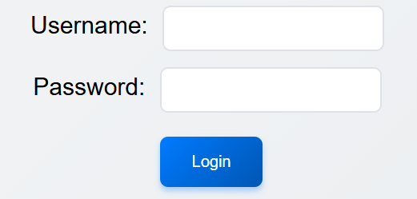

# HTML - Forms

Een belangrijk onderdeel van veel websites zijn formulieren. Formulieren stellen gebruikers in staat om informatie in te voeren en te verzenden, wat essentieel is voor interactie en functionaliteit op het web. 



Op onze startpagina, de kassa, hebben we een eenvoudig formulier dat gebruikers vraagt om hun gebruikersnaam en wachtwoord in te voeren voordat ze het park kunnen betreden. Dit is een typisch voorbeeld van een loginformulier, dat vaak wordt gebruikt om toegang te verlenen tot beveiligde delen van een website.

```html
<form id="kassa-form">
    <label for="username">Username:</label>
    <input type="text" id="username" name="username" required>
    <br>
    <label for="password">Password:</label>
    <input type="password" id="password" name="password" required>
    <br>
    <button type="submit">Login</button>
</form>
```

Als we naar de HTML-code van dit formulier kijken zien we dat we gebruik maken van verschillende HTML-elementen die specifiek zijn voor formulieren. We hebben een  
`<form>` element dat het hele formulier omsluit, en binnen dat element hebben we   
`<label>` elementen die de gebruikersnaam en het wachtwoord beschrijven, en  
`<input>` elementen waar de gebruiker daadwerkelijk hun informatie kan invoeren. Ten slotte hebben we een  
`<button>` element dat wordt gebruikt om het formulier te verzenden.

Omdat elke `<form>` uniek zou moeten zijn, markeren we het formulier met een `id` attribuut, zodat we er later in onze JavaScript code naar het formulier kunnen verwijzen. 

Het `<label>` element is belangrijk voor de toegankelijkheid van het formulier, omdat het een beschrijving geeft van wat er in het bijbehorende `<input>` veld moet worden ingevoerd. Het `for` attribuut van het `<label>` element moet overeenkomen met het `id` attribuut van het bijbehorende `<input>` element, zodat assistieve technologieën zoals schermlezers de relatie tussen de label en het invoerveld kunnen begrijpen.

De `<input>` elementen hebben verschillende `type` attributen. Het eerste `<input>` element heeft een `type` van "text", wat betekent dat het een standaard tekstinvoerveld is. Het tweede `<input>` element heeft een `type` van "password", wat betekent dat de invoer van de gebruiker wordt verborgen (meestal weergegeven als stippen of sterretjes) om de privacy te beschermen. Beide `<input>` elementen hebben ook het `required` attribuut, wat betekent dat de gebruiker verplicht is om deze velden in te vullen voordat het formulier kan worden verzonden.

> [!NOTE]
>
> Naast deze inputs zijn er nog veel andere soorten formulierelementen die we kunnen gebruiken, zoals [`<select>`](https://developer.mozilla.org/en-US/docs/Web/HTML/Reference/Elements/select) voor dropdown-menu's, [`<textarea>`](https://developer.mozilla.org/en-US/docs/Web/HTML/Reference/Elements/textarea) voor meerregelige tekstinvoer, en verschillende soorten [`<input>`](https://developer.mozilla.org/en-US/docs/Web/HTML/Reference/Elements/input) elementen zoals checkboxes, radio buttons, en meer.

Het laatste element in ons formulier is een `<button>` element met een `type` van "submit". Dit betekent dat wanneer de gebruiker op deze knop klikt, het formulier wordt verzonden. Standaard zal het verzenden van een formulier resulteren in een pagina herladen, maar we zullen dit gedrag in onze JavaScript code gaan onderbinden.

---

[:arrow_left: CSS- Grid](./Grid.md) | [:house: README](./README.md) | [JS - Basics :arrow_right:](./JS-Basics.md)
