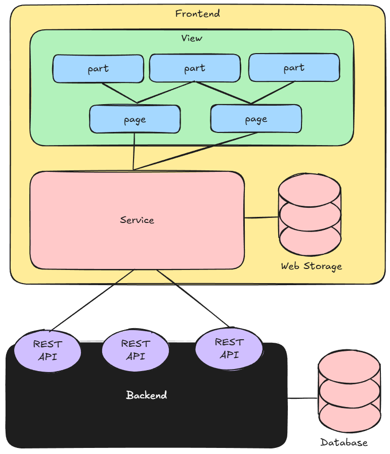

# Import & Export / File structuur

Doordat we in onze HTML de JavaScript met het attribuut `type="module"` hebben gemarkeerd, kunnen we gebruik maken van de moderne JavaScript functionaliteiten voor het importeren en exporteren van code tussen verschillende bestanden. Dit stelt ons in staat om onze code op te splitsen in kleinere, beter beheersbare stukken, wat de leesbaarheid en onderhoudbaarheid van onze codebase aanzienlijk verbetert.

```html
...
 <script type="module" src="./src/view/pages/kassa-page.js"></script>
 ...
 ```

We zouden ook alles in een enkele JavaScript file kunnen plaatsen, maar dat zou al snel onoverzichtelijk worden. Door onze code op te splitsen in verschillende bestanden kunnen we logische groepen van functionaliteit creëren en deze gemakkelijk terugvinden.

Voor de opsplitsing van onze frontend code bestaan er geen vaste regels, maar een handige aanpak is om een mappenstructuur te creëren die de verschillende onderdelen van onze applicatie logisch groepeert. Waarbij we voor nu adviseren om de volgende mappenstructuur voor de frontend code aan te houden:

```text
src
├── services
├── view
│   ├── pages
│   └── parts
```

## Pages

Zoals eerder aangegeven dient elke HTML pagina precies één JavaScript file te importern. Om flexibel en toekomstbestendig te zijn, is het handig dat elke html file zijn eigen JavaScript file heeft, ook al delen sommige pagina's nu nog dezelfde functionaliteit. Op deze manier kunnen we in de toekomst gemakkelijk verschillende functionaliteiten toevoegen aan verschillende pagina's zonder dat we een grote centrale JavaScript file hoeven te onderhouden.
Deze JavaScript file per pagina plaatsen we in de map `src/view/pages`.

Veel functionaliteit zal deze JavaScript file echter niet bevatten. De functionaliteiten van een pagina plaatsen we namelijk in aparte JavaScript files die we in de map `src/view/parts` plaatsen. De JavaScript page file importeert vervolgens de benodigde functionaliteiten vanuit de `parts` map en initialiseert deze.
Hierdoor bereiken we dat code die door meerdere pagina's gedeeld wordt niet in de JavaScript file van een specifieke pagina staat, maar in aparte files in de `parts` map, die door meerdere pagina's geïmporteerd kunnen worden.

We gebruiken hiervoor het `import` statement, waarmee we of een gehele file kunnen importeren of specifieke functies, klassen, of variabelen uit een file kunnen importeren. 

```javascript
// Importing specific functions from a file
import { className, functionName, variableName } from './path/to/file.js';
// Importing an entire file (which should have a default export)
import './path/to/file.js';
```

> [!NOTE]
> 
> Elke pagina kent een eigen JavaScript file die we met de ending `-page.js` aanduiden. Elke page JavaScript file importeert vervolgens minimaal één part JavaScript file. 


## Parts

Als we naar de User Interface kijken, zien we vaak features in de vorm van vlakken of onderdelen van de pagina. Elk van deze vlakken of onderdelen kunnen we zien als een "part" van onze applicatie. In onze applicatie hebben we bijvoorbeeld een navigatie onderdeel, een interactie onderdeel, en een lijstje met plekken die we willen bezoeken. Elk van deze onderdelen kunnen we implementeren in aparte JavaScript files in de `src/view/parts` map.

Omdat we deze 'parts' in elk geval in de JS Pages files willen gebruiken, moeten we deze exporteren. We kunnen ervoor kiezen om een hele file te exporteren, maar het is vaak handiger om specifieke functies, klassen, of variabelen te exporteren die we in onze pages kunnen importeren.
Om de import consistent te houden kiezen we ervoor om de export altijd aan het einde van de file te plaatsen. We kunnen deze export op verschillende manieren uitvoeren, afhankelijk van wat we willen exporteren.

```javascript
// Exporting specific functions, classes, or variables
export { functionName, className, variableName };
```

## Services

Om de presentatie van de data te scheiden, en omdat meerdere `parts` vaak gebruik maken van dezelfde data, kiezen we ervoor om onze de opslag en het ophalen van data te scheiden van de presentatie van de data. 
We plaatsen deze data opslag en ophaal functionaliteit in aparte JavaScript files in de `src/services` map. Deze services kunnen vervolgens door onze `parts` geïmporteerd worden, zodat we een duidelijke scheiding hebben tussen de data laag en de presentatie laag van onze applicatie.

De services zijn dus verantwoordelijk voor de opslag en het ophalen van data, maar niet voor de weergave ervan. De weergave van de data is de verantwoordelijkheid van de `parts`, die de services kunnen gebruiken om de benodigde data op te halen en deze vervolgens op een geschikte manier aan de gebruiker te presenteren.

En om de services niet te complex te maken, kiezen we ervoor om elke service omtrent een specifieke feature te implementeren.
In onze applicatie is dat een feature die te maken heeft met de kaart (`map-service.js`), die dus kan vertellen waar op de kaart een gebruiker zich bevind, dan wel informatie kan verstrekken omtrent een specifieke locatie op de kaart. 
Daarnaast zouden we ook een service kunnen introduceren omtrent een gebruiker (`user-service.js`), die diensten aan zou kunnen bieden om een gebruiker in te loggen, of om informatie over een gebruiker op te slaan en op te halen.
In onze applicatie hebben we dat echter uit didactische overwegingen niet gedaan, maar het zou wel beter zijn geweest om deze scheiding te maken, zodat we de complexiteit die nu in onze `login-form.js` part file zit, hadden kunnen verminderen.

## Conclusie

Met de opsplitsing van de frontend code in view en services, en de verdere opsplitsing van de view code in pages en parts, creëren we een duidelijke structuur voor onze codebase. Deze structuur maakt het gemakkelijker om de code te begrijpen, te onderhouden, en uit te breiden in de toekomst.
Zodoende zouden we tot het volgende architectuur diagram kunnen komen:




