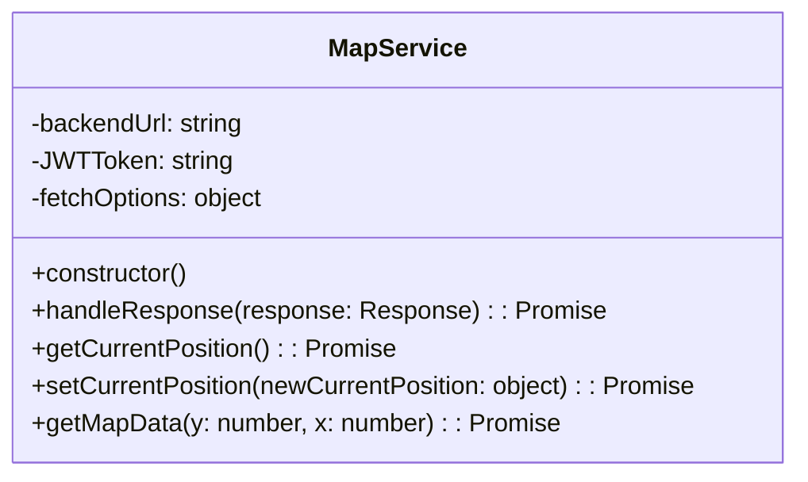
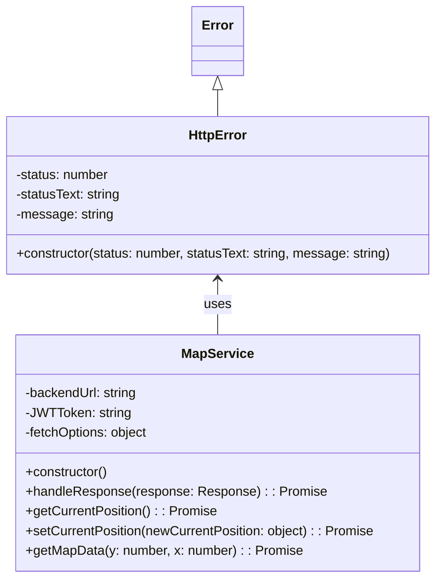
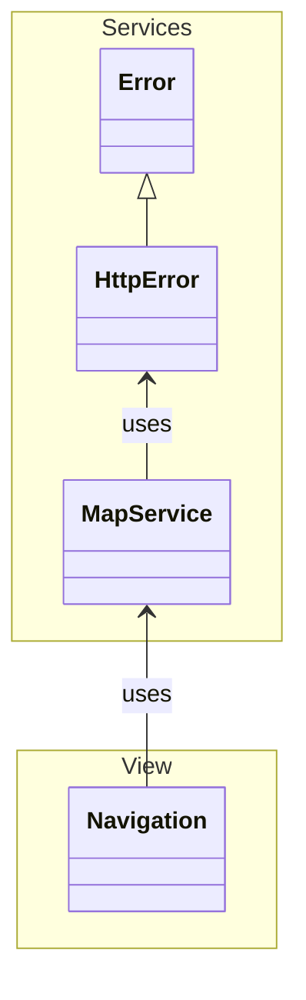

# JavaScript Object-Oriented Programming (OOP)

Van origine had JavaScript geen klassen, maar werden er functies gebruikt om objecten te maken en te organiseren. In ES6 (ECMAScript 2015) zijn classes geïntroduceerd als syntactische suiker bovenop het bestaande prototype-gebaseerde systeem van JavaScript. Klassen bieden een meer traditionele en gestructureerde manier om objecten te definiëren en te organiseren, vergelijkbaar met andere objectgeoriënteerde programmeertalen zoals Java of C++.

In JavaScript kunnen klaasen worden gebruikt om objecten te maken die eigenschappen (data) en methoden (functies) bevatten. Een class kan worden gezien als een blauwdruk voor het maken van objecten, waarbij je een class definieert en vervolgens instanties van die class maakt.
In principe zijn alle methoden en properties die je in een class definieert public. In het verleden werd derhalve vaak een underscore aan het begin van de property of methode gebruikt om aan te geven dat deze private was, maar tegenwoordig is er ook de mogelijkheid om daadwerkelijk private properties en methods te maken door gebruik te maken van het `#` symbool.

```javascript
class SomeClass {

    #aPrivateProperty;

    constructor() {
        // Constructor code
        this.aPublicProperty = 'This is a public property';
        this.#aPrivateProperty = 'This is a private property';
    }

    aPublicMethod() {
        // Method code
    }

    #aPrivateMethod() {
        // Private method code
    }
}

const instance = new SomeClass();
```

In onze applicatie hebben we bijvoorbeeld een `MapService` class die verantwoordelijk is voor het communiceren met de backend om data op te halen en te versturen. Deze class bevat methoden zoals `getCurrentPosition`, `setCurrentPosition` en `getMapData`, die allemaal gebruik maken van de Fetch API om HTTP-verzoeken te doen naar de backend, maar ook een centrale `handleResponse` methode die de HTTP-responses valideert en errors afhandelt. Omdat deze `handleResponse` methode alleen intern in de `MapService` class wordt gebruikt, hadden we er beter voor kunnen kiezen om deze private te maken door er een `#` symbool voor te zetten, zodat we duidelijk maken dat deze methode niet bedoeld is om van buiten de class te worden aangeroepen.

```javascript
import { HttpError } from './http-error.js';

class MapService {

    constructor() {
        this.backendUrl = './api/map';
        this.JWTToken = localStorage.getItem('jwtToken') || null; // Placeholder for JWT token if needed in the future
        this.fetchOptions = {
            headers: {
                'Authorization': `Bearer ${this.JWTToken}`
            }
        };
    }

    /**
     * Centralized response handler that validates HTTP status and propagates error information.
     * @param {Response} response - The fetch response object.
     * @returns {Promise<any>} - Parsed JSON response.
     * @throws {HttpError} - Custom error with status, statusText, and message.
     */
    handleResponse(response) {
        if (!response.ok) {
            const error = new HttpError(
                response.status,
                response.statusText || `HTTP ${response.status}`,
                `Request failed with status ${response.status}`
            );
            throw error;
        }
        return response.json();
    }

    getCurrentPosition() {
        return fetch(`${this.backendUrl}/current_position`, this.fetchOptions)
            .then((response) => this.handleResponse(response))
            .catch(error => {
                console.error('Error fetching current position:', error);
                throw error;
            });
    }

    setCurrentPosition(newCurrentPosition) {
        return fetch(`${this.backendUrl}/${newCurrentPosition.x}/${newCurrentPosition.y}`, {
            method: 'PUT',
            headers: {
                'Content-Type': 'application/json',
                'Authorization': `Bearer ${this.JWTToken}`
            },
            body: JSON.stringify(newCurrentPosition)
        })
        .then((response) => this.handleResponse(response))
        .catch((error) => {
            console.error('Error setting current position:', error);
            throw error;
        });
    }

    getMapData(y, x) {
        // TODO: Needs to be ajusted to fetch the correct map data from the tomcat backend, due to issues with the json-server working with :id's.
        console.log(`Fetching map data ...`);
        return fetch(`${this.backendUrl}/${x}/${y}`, this.fetchOptions)
            .then((response) => this.handleResponse(response))
            .catch((error) => {
                console.error('Error fetching map data:', error);
                throw error;
            });
    }
}

const mapService = new MapService();

export { mapService };
```

Het bijbehorende class diagram zou er als volgt uit kunnen zien:



Uit de code vna de `MapService` class kunnen we ook zien dat deze class gebruik maakt van een `HttpError` class om errors te representeren die kunnen optreden bij het maken van HTTP-verzoeken. 
Deze `HttpError` class is een custom error class die we zelf hebben gemaakt om meer informatie te kunnen geven over HTTP-fouten, zoals de statuscode, status text en een custom message. Deze class ziet er als volgt uit:

```javascript
class HttpError extends Error {
    constructor(status, statusText, message) {
        super(message);
        this.status = status;
        this.statusText = statusText;
        this.name = 'HttpError';
    }
}

export { HttpError };
```

Wat we nu zien is dat we met `extends` net als in andere objectgeoriënteerde talen een nieuwe class kunnen maken die gebaseerd is op een bestaande class, in dit geval de ingebouwde `Error` class van JavaScript. 
Door `extends Error` te gebruiken, erft onze `HttpError` class alle eigenschappen en methoden van de `Error` class, maar we kunnen ook extra eigenschappen toevoegen zoals `status` en `statusText`, en we kunnen ook de constructor aanpassen om deze extra informatie te initialiseren.



En omdat de `MapService` class, die onderdeel van onze `Service `map is gebruik wordt door de `Navigation` class die in de `View` leeft, kunnen we ook nog een `Navigation` class toevoegen aan ons class diagram, en aangeven dat deze class gebruik maakt van de `MapService` class:


> [!NOTE]
>
> Een `implements` relatie zo als je die uit Java kent, bestaat niet in JavaScript. En ook `abstract` class of methods bestaan niet in JavaScript. 

---

[:arrow_left: Ontwerp - Data Structure Design](./Data-Structure-Design.md) | [:house: README](./README.md) | [JS - Try-Catch :arrow_right:](./Try-Catch.md)