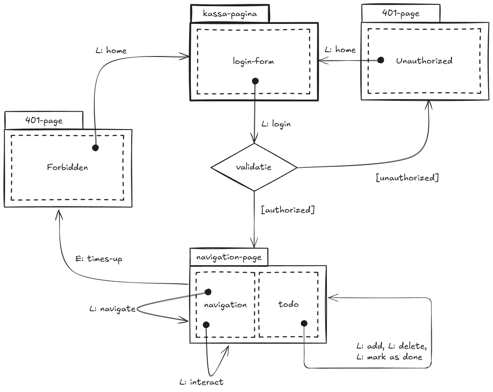

# Doel

We willen een online ervaring realiseren voor "De ~~E~~(HU)fteling". In deze Frontend Workshop gaan we dat doen door een virtuele wandeling door een gedeelte van het park te realiseren.

We beginnen onze wandeling bij de kassa die je moet passeren voordat je het park in mag. Als je niet langs de kassa bent geweest, mag je het park niet in.
Eens binnen mag je alleen over de paden lopen. Bij sommige punten in het park kun je interacteren met de omgeving, bijvoorbeeld door een attractie te bezoeken of een snack te kopen. Maar je mag alleen interacteren als je op een plek staat waar dat kan.
In het kader van de workshop is de interactie echter heel erg basic.

Helaas zijn op onze kaart de attracties en servicepunten niet aangegeven, waardoor we zelf een lijstje gaan bijhouden van de plekken die we willen bezoeken. Als we een plek hebben bezocht kunnen we die afvinken van ons lijstje. Maar we kunnen ook items van ons lijstje verwijderen als we besluiten dat we die plek toch niet willen bezoeken, of juist items toevoegen als we ons onderweg bedenken.

Er zit echter een tijdslimiet aan onze wandeling, dus we moeten wel een beetje opschieten. Als we ons timeslot overschrijden, worden we vriendelijk verzocht het park te verlaten.

Het omzetten van deze ervaring naar een online omgeving geeft ons de volgende sitemap:

Het realiseren van deze sitemap vraagt om een aantal frontend technieken, die we in de volgende hoofdstukken zullen behandelen.
Aan de hand van deze technieken zou jij je eigen frontend van je miniproject moeten kunnen realizeren, of in ieder geval een goede start kunnen maken.

- [[HTML] Semantische HTML](./Semantische_html.md)
- [[CSS] Grid](./Grid.md)
- [[HTML] Forms](./Forms.md)
- [[JS] Basics](./JS-Basics.md)
- [[JS] Import/Export en file structuur](./Import-Export.md)
- [[JS] QuerySelector](./Queryselector.md)
- [[JS] Event Listeners](./EventListener.md)
- [[JS] Forms uitlezen](./Reading-Forms.md)
- [[JS] REST Fetch API en Promises](./Fetch-Promises.md)
- [[JS] Web Storage API](./Web-Storage.md)
- [[Ontwerp] Datastructuur en REST API design](./Data-Structure-Design.md)
- [[JS] Klassen en OOP](./JS-Class.md)
- [[JS] Try/Catch](./Try-Catch.md)
- [[JS] DOM Manipulatie](./DOM-Manipulation.md)
- [[JS] Arrays en bewerkingen daarop](./Arrays.md)
- [[HTML / JS] Templates en dynamische rendering](./Templates-Dynamic-Rendering.md)
