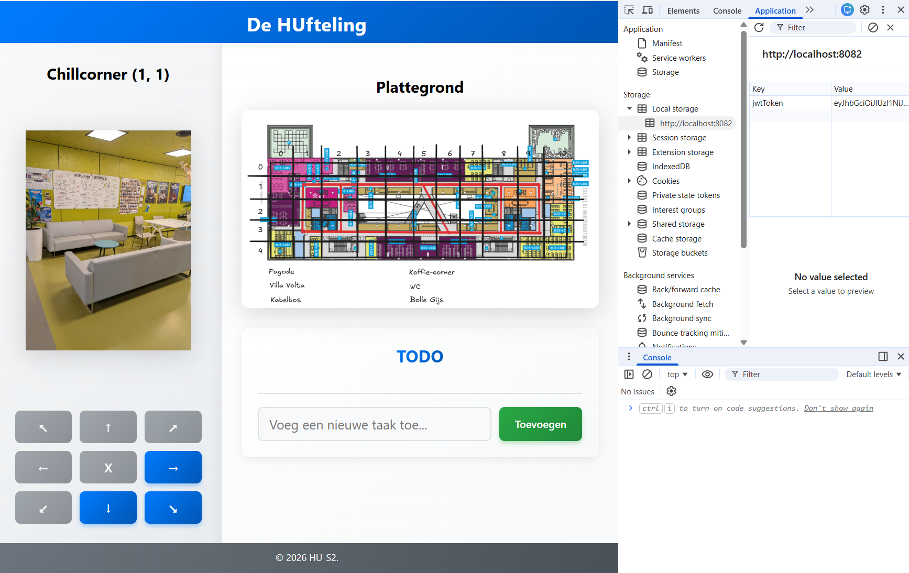

# Web Storage

In JavaScript kunnen we data opslaan in variabelen, maar als we de pagina herladen, gaan al die data verloren, omdat ze alleen in het geheugen van de browser bestaan. We gebruiken derhalve de backend server om data op te slaan, maar soms willen we ook data lokaal aan de client-side (de frontend/browser) opslaan, bijvoorbeeld om data van de ene pagina naar de andere mee te nemen, of om data te bewaren voor later gebruik. 

De browser biedt hiervoor de Web Storage API, waarmee we data aan de client kant kunnen opslaan. Er zijn verschillende opties om data aan de client side op te slaan. De meest bekende en ook eenvoudigsten in het gebruik zijn cookies, localStorage en sessionStorage.

## Cookies 

Cookies is een oudste manier om data aan de client side op te slaan, en worden vaak gebruikt voor het opslaan van kleine stukjes data, zoals sessie-informatie of gebruikersvoorkeuren. Cookies hebben echter een aantal nadelen, zoals beperkte opslagcapaciteit (ongeveer 4KB per cookie), en dat ze automatisch worden meegestuurd bij elke HTTP request naar de server, wat kan leiden tot prestatieproblemen als er veel cookies zijn.

Omdat cookies elke keer worden meegestuurd bij een HTTP request, kunnen ze ook een beveiligingsrisico vormen, omdat ze kunnen worden onderschept door kwaadwillenden als ze niet goed worden beveiligd.

Daarnaast moeten gebruikers expliciet toestemming geven voor het gebruik van cookies (cookie wall), wat kan leiden tot een slechte gebruikerservaring als er te veel cookie pop-ups zijn.
In deze workshop gaan we geen gebruik maken van cookies en zullen derhalve ook niet verder ingaan op de details en het gebruik van cookies.

## localStorage en sessionStorage

localStorage en sessionStorage zijn client side opslagopties die na de komst van de cookies zijn geïntroduceerd, en die een aantal voordelen bieden ten opzichte van cookies. Ze hebben een grotere opslagcapaciteit (ongeveer 5MB per domein), en ze worden niet automatisch meegestuurd bij HTTP requests, wat betekent dat ze geen prestatieproblemen veroorzaken zoals cookies dat kunnen doen.

Beide opties bieden een eenvoudige API voor het opslaan, ophalen en verwijderen van data, en ze zijn gemakkelijk te gebruiken in JavaScript. Het belangrijkste verschil tussen localStorage en sessionStorage is dat localStorage data opslaat die persistent is, wat betekent dat de data blijft bestaan zelfs als de browser wordt gesloten, terwijl sessionStorage data opslaat die alleen beschikbaar is tijdens de sessie van de gebruiker, en die wordt verwijderd zodra de browser wordt gesloten.

De keuze tussen localStorage en sessionStorage hangt af van de specifieke behoeften van je applicatie. Als je data wilt opslaan die persistent moet zijn, zoals gebruikersinstellingen, dan is localStorage de beste optie. Als je data wilt opslaan die alleen relevant is tijdens de sessie van de gebruiker, zoals de actuele GPS-locatie of een sessie-id, dan is sessionStorage de betere keuze.

Bij het JWT token kunnen we bijvoorbeeld kiezen voor localStorage, omdat we willen dat het token persistent is en beschikbaar blijft, zelfs als de gebruiker de pagina herlaadt of de browser sluit en opnieuw opent. Aan de andere kant, zouden we een bank applicatie maken dan zou je uit veiligheidsoverwegingen beter kunnen kiezen om de JWT token in sessionStorage op te slaan, omdat dat betekent dat het token automatisch wordt verwijderd zodra de gebruiker de browser sluit, wat een extra beveiligingslaag toevoegt in het geval dat iemand anders toegang krijgt tot de computer van de gebruiker.

local- en sessionStorage kennen beiden dezelfde eenvoudige API, die bestaat uit de volgende methoden:

- `setItem(key, value)`: Hiermee kun je een item opslaan in de storage. De `key` is een string die fungeert als de naam van het item, en de `value` is de data die je wilt opslaan, ook als string.
- `getItem(key)`: Hiermee kun je een item ophalen uit de storage. Je geeft de `key` op van het item dat je wilt ophalen, en het retourneert de bijbehorende `value` als een string. Als het item niet bestaat, retourneert het `null`.
- `removeItem(key)`: Hiermee kun je een item verwijderen uit de storage. Je geeft de `key` op van het item dat je wilt verwijderen, en het wordt verwijderd uit de storage.
- `clear()`: Hiermee kun je alle items verwijderen uit de storage. Dit verwijdert alle items die zijn opgeslagen in de storage, en maakt het leeg.
- `key(index)`: Hiermee kun je de `key` van een item ophalen op basis van de index. Je geeft een `index` op, en het retourneert de `key` van het item op die index. De index is gebaseerd op de volgorde waarin items zijn toegevoegd aan de storage.
- `length`: Dit is een eigenschap die het aantal items in de storage retourneert. Het geeft aan hoeveel items er momenteel zijn opgeslagen in de storage.

De data die we opslaan in localStorage of sessionStorage moet altijd een string zijn. Als we een ander type data willen opslaan, zoals een object of een array, moeten we die eerst omzetten naar een string, bijvoorbeeld door gebruik te maken van `JSON.stringify()`, en als we die data weer willen ophalen, moeten we die weer omzetten naar het oorspronkelijke type, bijvoorbeeld door gebruik te maken van `JSON.parse()`.

In onze applicatie gebruiken we de localStorage API om het JWT token op te slaan dat we ontvangen van de backend na een succesvolle login, zodat we dat token kunnen gebruiken voor authenticatie bij toekomstige requests naar de backend, en zodat we ook kunnen controleren of een gebruiker is ingelogd of niet door te checken of er een geldig token aanwezig is in localStorage.

```javascript
    fetch('./api/authentication', {
        method: 'POST',
        headers: {
            'Content-Type': 'application/json'
        },
        body: JSON.stringify(data)
    })
    .then((response) => {
        // Als de response niet ok is, controleer of het een 401 status is en redirect naar de 401 pagina, anders gooi een fout.
        if (!response.ok) {
            if (response.status === 401) {
                window.location.href = '401.html';
            }
            throw new Error('Authentication failed');
        }
        // Als de response ok is, parse de JSON en return het token.
        return response.json();
    })
    // Als het token succesvol is ontvangen, sla het JWT token op in localStorage en redirect naar de navigate pagina.
    .then((token) => {
        // Store the JWT token in localStorage or sessionStorage
        localStorage.setItem('jwtToken', token.JWT);
        window.location.href = 'navigate.html';
    })
    .catch((error) => {
        console.error('Error:', error);
    });
```

Dat we data in de localstorage hebben staan kun je in de Dev Tools van je browser terugzien, onder de Application tab, in het gedeelte Local Storage. Daar kun je ook data verwijderen of aanpassen, en dat heeft direct effect op je applicatie.



Het uitlezen van de data uit localStorage hebben we in onze applicatie in de MapService class ondergebracht. Dit omdat het werken met de localstorage en/of sessionStorage een taak en verantwoordelijkheid van de service zou moeten zijn en niet zoals in de `login-form.js` code een taak van de `view` laag.
Dit omdat er anders een zogenaamde **tight coupling** ontstaat tussen de `login-form.js` en de manier waarop we de JWT token opslaan, omdat we in de `login-form.js` direct gebruik maken van `localStorage.getItem('jwtToken')`, en dat betekent dat als we ooit zouden willen switchen naar een andere manier van opslaan, zoals bijvoorbeeld IndexedDB, of dat we de key van onze JWT token zouden willen wijzigen, dat we dan ook onze `login-form.js` moeten aanpassen, omdat die direct afhankelijk is van de manier waarop we de JWT token opslaan. Door het gebruik van een service class die verantwoordelijk is voor het opslaan en ophalen van de JWT token, kunnen we deze afhankelijkheid verminderen en een **loose coupling** creëren, omdat we dan de manier waarop we de JWT token opslaan en ophalen kunnen abstraheren, en dat we dan in de toekomst makkelijk kunnen switchen naar een andere opslagmethode als dat nodig is, zonder dat we overal in onze code aanpassingen hoeven te maken. We zouden bijvoorbeeld een `AuthService` class kunnen maken die verantwoordelijk is voor het opslaan en ophalen van de JWT token, en dat we die class dan kunnen gebruiken in zowel de `login-form.js` als de `navigate.js`, zodat we daar geen directe afhankelijkheid meer hebben van `localStorage`, en dat we die in de toekomst makkelijk kunnen vervangen door bijvoorbeeld IndexedDB of een andere opslagmethode als dat nodig is.

```javascript
class MapService {

    constructor() {
        this.backendUrl = './api/map';
        this.JWTToken = localStorage.getItem('jwtToken') || null; // Placeholder for JWT token if needed in the future
        this.fetchOptions = {
            headers: {
                'Authorization': `Bearer ${this.JWTToken}`
            }
        };
    }
```

## Cache en IndexedDB

Zoals eerder aangegeven zijn er inmiddels ook andere opties in de browser om data op te slaan, zoals Cache API en IndexedDB, die meer geavanceerde mogelijkheden bieden voor het opslaan van grotere hoeveelheden data, zoals afbeeldingen, bestanden of gestructureerde data. Deze opties zijn echter complexer in het gebruik dan localStorage en sessionStorage, en vereisen meer kennis van JavaScript en de browser API's om ze effectief te kunnen gebruiken. In deze workshop zullen we ons daarom richten op localStorage en sessionStorage, omdat die eenvoudiger zijn in het gebruik en voldoende functionaliteit bieden voor de behoeften van onze applicatie.

---

[:arrow_left: JS - Promises & Fetch](./Fetch-Promises.md) | [:house: README](./README.md) | [Ontwerp - Datastructuur en REST API design :arrow_right:](./Data-Structure-Design.md)